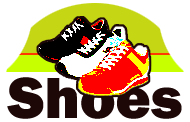
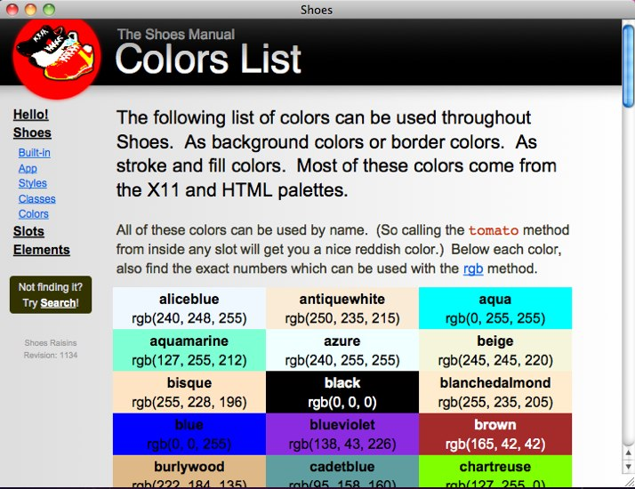

!SLIDE 

## Teaching Ruby To Kids
#####&nbsp;
#####Sarah Mei
#####&nbsp;
#####@sarahmei
#####sarahmei@gmail.com

!SLIDE 

## Expanding Young Minds With Ruby 
#####&nbsp;
#####Sarah Mei
#####&nbsp;
#####@sarahmei
#####sarahmei@gmail.com

!SLIDE

## About me

!SLIDE

## GetSET

!SLIDE

!SLIDE

## Philosophy

!SLIDE

## Programming and Language

!SLIDE

## Setup

!SLIDE

<pre><code>
Shoes.app do

end
</code></pre>

!SLIDE

!SLIDE

<pre><code>
Shoes.app do
  para "Hello, world"
end
</code></pre>

!SLIDE

!SLIDE

<pre><code>
Shoes.app do
  para "Hello, world", :align => "center",
    :size => "xx-large"
end
</code></pre>

!SLIDE

!SLIDE

<pre><code>
Shoes.app :title => "My awesome application" do
  para "Hello, world", :align => "center",
    :size => "xx-large"
end
</code></pre>

!SLIDE

!SLIDE

<pre><code>
Shoes.app :title => "My awesome application" do
  background tomato
  para "Hello, world", :align => "center",
    :size => "xx-large"
end
</code></pre>

!SLIDE

!SLIDE

<pre><code>
Shoes.app :title => "My awesome application" do
  background tomato
  para "Hello, world", :align => "center",
    :size => "xx-large",
    :stroke => saddlebrown
end
</code></pre>

!SLIDE

!SLIDE

<pre><code>
Shoes.app :title => "My awesome application" do
  def periwinkle
    rgb(180,170,205)
  end
  background periwinkle
  para "Hello, world", :align => "center",
    :size => "xx-large", 
    :stroke => saddlebrown
end
</code></pre>

!SLIDE

!SLIDE

!SLIDE

<pre><code>
Shoes.app :title => "My awesome application" do
  def periwinkle
    rgb(180,170,205)
  end
  background periwinkle

  button "Change the text" do
    @headline.text = "I'm changed!"
  end

  @headline = para "Hello, world",
    :align => "center", 
    :size => "xx-large", 
    :stroke => saddlebrown
end
</code></pre>

!SLIDE

!SLIDE

<pre><code>
Shoes.app :title => "My awesome application" do
  def periwinkle
    rgb(180,170,205)
  end
  background periwinkle

  animate do 
    @button, @left, @top = self.mouse
    @headline.text =
      "#{@button} #{@left} #{@top}"
  end

  @headline = para "Hello, world",
    :align => "center", 
    :size => "xx-large", 
    :stroke => saddlebrown
end
</code></pre>

!SLIDE

!SLIDE

<pre><code>
Shoes.app :title => "My awesome application" do
  def periwinkle
    rgb(180,170,205)
  end
  background periwinkle

  animate do 
    @button, @left, @top = self.mouse
    line 0, 0, @left, @top
  end

  @headline = para "Draw!",
    :align => "center", 
    :size => "xx-large", 
    :stroke => saddlebrown
end
</code></pre>

!SLIDE

!SLIDE

<pre><code>
Shoes.app :title => "My awesome application" do
  def periwinkle
    rgb(180,170,205)
  end
  background periwinkle

  animate do 
    @button, @left, @top = self.mouse
    unless @button == 0
      line 0, 0, @left, @top
    end
  end

  @headline = para "Draw!",
    :align => "center", 
    :size => "xx-large", 
    :stroke => saddlebrown
end
</code></pre>

!SLIDE

!SLIDE

<pre><code>
Shoes.app :title => "My awesome application" do
  def periwinkle
    rgb(180,170,205)
  end
  background periwinkle

  animate do 
    previous_left = @left
    previous_top = @top
    @button, @left, @top = self.mouse
    unless @button == 0
      line previous_left, previous_top,
        @left, @top
    end
  end

  @headline = para "Draw!",
    :align => "center", 
    :size => "xx-large", 
    :stroke => saddlebrown
end
</code></pre>

!SLIDE

!SLIDE

<pre><code>
  # ...
  animate do 
    # ...
  end

  button "Clear" do
    background periwinkle
    @headline.remove
    @headline = para "Draw!",
      :align => "center", 
      :size => "xx-large", 
      :stroke => saddlebrown
  end

  @headline = para "Draw!",
    :align => "center", 
    :size => "xx-large", 
    :stroke => saddlebrown

end
</code></pre>

!SLIDE

!SLIDE

### Why was it successful?
* ruby
* &nbsp;
* &nbsp;
* &nbsp;

!SLIDE

### Why was it successful?
* ruby - choose the right tools
* &nbsp;
* &nbsp;
* &nbsp;

!SLIDE

### Why was it successful?
* ruby - choose the right tools
* visual
* &nbsp;
* &nbsp;

!SLIDE

### Why was it successful?
* ruby - choose the right tools
* visual - frequent deployment
* &nbsp;
* &nbsp;

!SLIDE

### Why was it successful?
* ruby - choose the right tools
* visual - frequent deployment
* small steps
* &nbsp;

!SLIDE

### Why was it successful?
* ruby - choose the right tools
* visual - frequent deployment
* small steps - short iterations
* &nbsp;

!SLIDE

### Why was it successful?
* ruby - choose the right tools
* visual - frequent deployment
* small steps - short iterations
* flexible

!SLIDE

### Why was it successful?
* ruby - choose the right tools
* visual - frequent deployment
* small steps - short iterations
* flexible - constant customer interaction

!SLIDE

### Acknowledgements
##### &nbsp;
##### Screenshots - Satoshi Asakawa (@ashbb)
##### GetSET - www.getset.org
##### RailsBridge - teachingkids.railsbridge.org
##### Slidedown - Pat Nakajima (@nakajima)

!SLIDE

### Thank you!
##### &nbsp;
##### sarahmei@gmail.com
##### @sarahmei